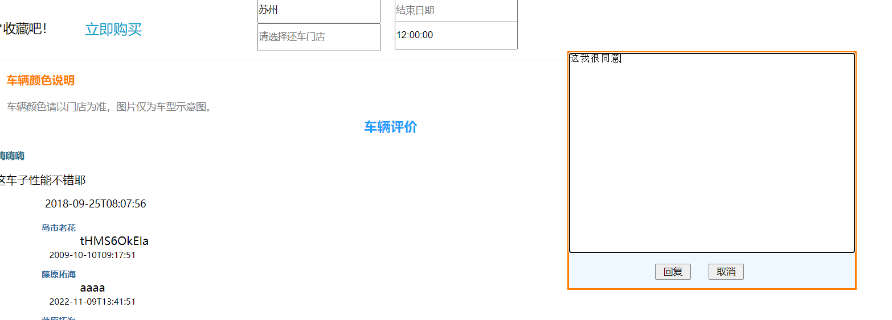
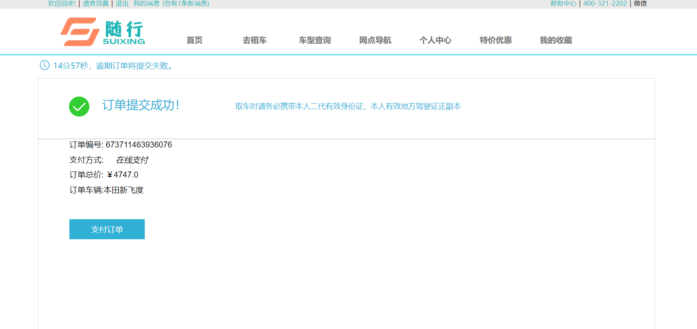

# 随行租车

#### 项目介绍

这是一个仿照一嗨租车开发的基于Spring Boot的租车项目，用户注册并登录该平台，登录注册采用了MD5前后端同时加密的技术，
登录完了之后，可以在主页面看到当前热门的车型，然后进行预定车辆。还可以根据定位推荐附近门店，之后便可根据时间段和门店
进行租借想要使用的车辆。用户可以根据时间、品牌，价格等多种条件查询合适时间段的车辆，还可以查看车辆详情等等。在车辆详情页面，
用户可以查看当前车型的评价，还能对评价的人进行回复，如果觉得评价实用的话还可以对评价进行点赞，在选择完喜欢的车辆之后进行预定，预定的时候可以根据用户领取的优惠券来减免费用，预定成功之后提交订单，
然后进行用户信息的填写，用户可以进行手动填写和利用OCR技术进行对上传的身份证和驾驶证进行识别并填入，然后进行支付订单。

支付采用支付宝沙箱的技术进行支付，支付完成之后，可以查看订单详情。租期到期后，用户可以在订单详情中一间还车，如果用户对于服务有什么建议的话还可以对此次租车服务进行评价。

#### 项目功能思维导图

#### 开发者

**付朝红、甘伟、柴春旭、王璐瑶**

#### 项目收获

1.通过这个项目，我一方面积累了大量的项目经验，在团队协作的过程中，积极讨论问题，提出自己的观点并质疑，然后一起解决,
使我的团队协作能力得到了提高，对项目的操作流程更加娴熟。

2.另一方面我的学习能力得到了很大提高，在项目的过程中,通过向别人请教问题，并且自己独立解决和不断帮助他人解决问题，
使我的解决问题的能力得到了很大提高，通过与他人的不断沟通，使自己的语言组织能力和语言表达能力都有了很大提升。

3.通过自己独立的研究技术，遇到不会的问题时，我会去官网查资料然后不断解决，通过自己一直钻研，我学会了很多一直以来都
难以克服的困难，解决了很多难题，使我得到了成长，同时也总结了很多心得

4.在团队协作的过程中，我深深的明白了团结合作的重要性，通过分工合作，一方面可以使工作效率大大提高，另一方面可以技术
共享，使每个人都有所长，都能够掌握更多的知识和技术

5.通过平时一点一滴的积累，一方面使我的身心得到了成长，另一方面也加强了我对java的热爱。

#### 软件架构说明

该项目用到的框架是Spring boot 2.5.7

持久层通过Mybatis逆向工程生成

数据库使用的是MySQL:8.0.25

#### 技术栈

SpringBoot、MyBatis-Plus、Redis、 Elasticsearch搜索引擎、Mahout推荐，MD5双重加密、RabbitMQ、支付宝沙箱支付、高德地图、WebSocket、阿里云存储和验证码、OCR识别…

#### 项目功能介绍

（1）用户登陆注册，查看个人收藏、消息、订单等信息；

（2）查询，筛选车型及查看车辆详情；

（3）查看营业网点；

（4）特价优惠活动，领取优惠券；

（5）评论回复点赞；

（6）优惠券，订单消息推送；

（7）预定车辆；

（8）手动填写或者图文识别上传租车人信息。

（9）提交订单，支付

（10）订单管理和查看订单详情

# CarDemo
# CarDemo
